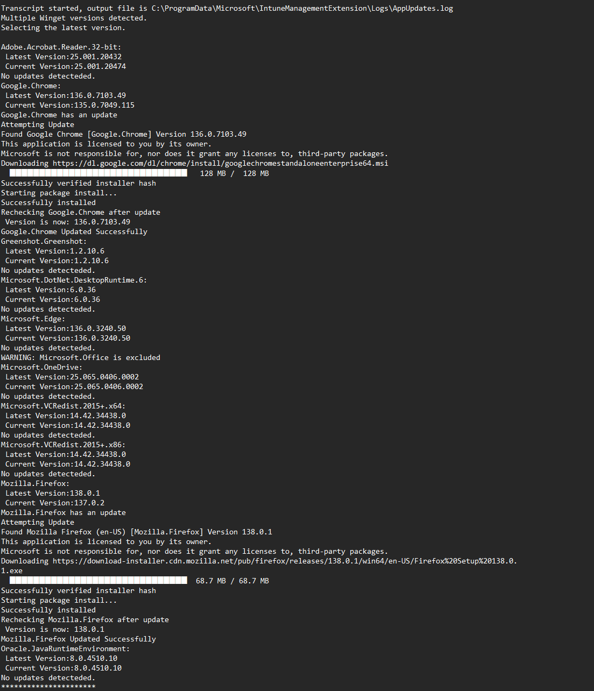

Keep Microsoft and 3rd Party Apps up to date with Winget.
Deploy as Remediation script with these script in Microsoft Intune.

Exclude Apps that you dont want upgraded in the $excludedApps list with the apps ID

Include only certian apps you want upgraded in the $includedApps list. Leaving the list blank will upgrade all available winget apps except for the excluded apps list.
Find the App ID by running winget search *appname* in powershell 

Logs output to C:\ProgramData\Microsoft\IntuneManagementExtension\Logs\AppUpdates.log after running and attempting app updates in any version. 

Log snip looks like this: 

